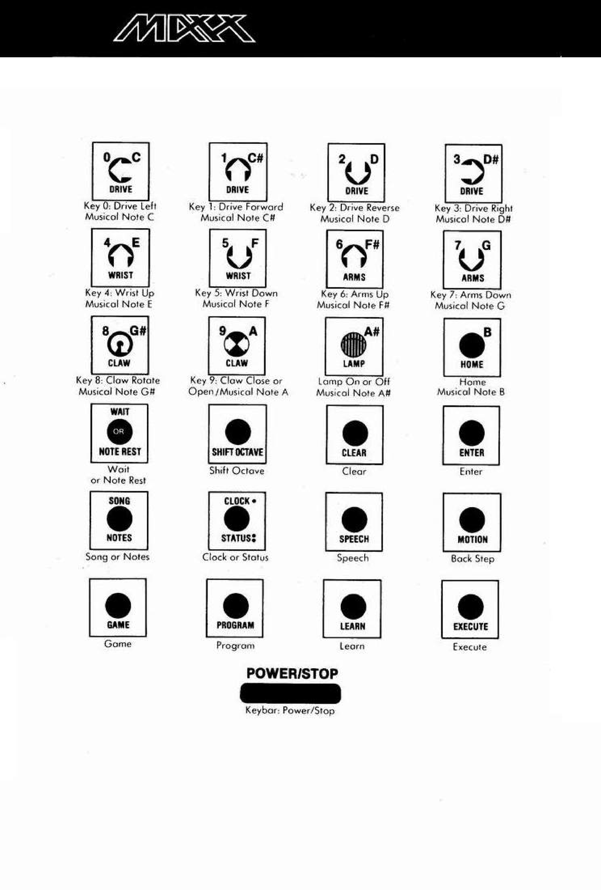

# Chapter 2 — Setup

Cross-reference: factory keypad labels and matrix map in [`Transmitter/remote-keypad.md`](../../Transmitter/remote-keypad.md).

### 2.1 Unpacking

Carefully remove Maxx, packed in foam shipping shells, from his box.
Then carefully spread apart the shells.

> NOTE: Always lift Maxx by his shoulders, DO NOT LIFT HIM BY HIS

ARMS AS THIS MIGHT DAMAGE THE ARMS.

### 2.2 Activating Maxx's power

MAXX’S POWER

Maxx's POWER SWITCH is located inside his chest storage compart-
ment in the lower left corner. This controls all Maxx's electronics,
including the clock and memory.

To Turn On The Power Switch:

- Remove TAPE from POWER SWITCH.

- Put the POWER SWITCH UP into the ON position. Maxx will respond
by saying, ‘Hello. I am Maxx Steele. [TUNE PLAYS] I'm ready."

- If Maxx does not respond in exactly this way, shut off the POWER

SWITCH, wait 2 seconds, and turn it on again.

- Close CHEST PANEL DOOR and push the button up to latch.

> NOTE: Turning this switch off will result in the loss of anything you may

have programmed.

Charge Maxx fully before his first use. When he needs a charge, he will
ask for it by saying, “Il need energy. Please recharge me." (Refer to
LABEL inside his CHEST COMPARTMENT DOOR.) Maxx’s CHARGER
comes packed ina recessed pocket of the foam shell he was shipped in.

> NOTE: Maxx should be recharged with the POWER SWITCH in the

OFF position; however, any program stored in his memory will be
erased. Maxx can be charged with POWER SWITCH ON, but he
should first be placed in the Power-Down or ‘`Sleep` Mode (see
Sections 5.3, 5.31 and 5.32).

elo Charge Maxx:

- Insert CHARGER OUTPUT PLUG into CHARGER JACK located at
the bottom right rear of Maxx.

- Plug CHARGER WALL PLUG into a standard wall out.

- Once charged, disconnect jack and wall plug.

- Maxx’s battery cannot be overcharged. Charge Maxx whenever he
is not in use. Under normal circumstances, an overnight charge every
night will be sufficient.

> NOTE: Do not engage Maxx's MOTION functions while he is charging.

sudden movement may disconnect or damage the charger plug and
jack.

> IMPORTANT: WHEN MAXX NEEDS A CHARGE, HE WILL ASK FOR IT.

NEVER IGNORE HIS REQUEST FOR A CHARGE, OR HE MAY REQUIRE
UP TO A WEEK OF CONTINUOUS CHARGING TO RESTORE SUFFI-
CIENT BATTERY POWER FOR OPERATION.

### 2.3 Charging Maxx

Maxx’s controller is used as a remote control keypad. It is also used to
program a sequence of actions for Maxx to perform, now or later,

The information listed below shows you how to use the controller to
enter commands you want Maxx to perform. (see APPENDIX J.

SUMMARY OF CONTROLLER FUNCTIONS AND SPECIAL KEYS for
more detailed information.)

### 2.4 The controller

