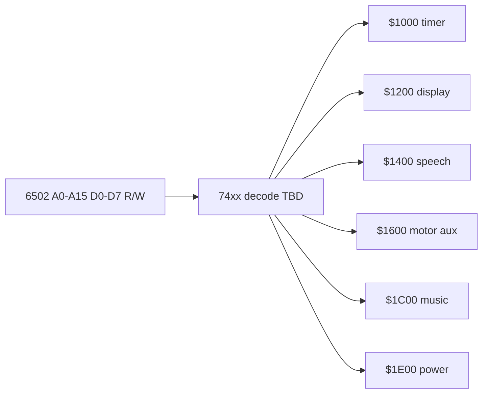

# MMIO pin map (partial schematic)

Block-level map from **6502 CPU pins** through **address decode** to **peripheral MMIO** addresses documented in internal ROM. This is not a full KiCad netlist — it is the minimum hardware layer needed to explain OS drivers in [Technical Manual Ch 5–6](../../TechnicalManual/05-Cartridge-Bootstrap-and-Internal-ROM.md).

**Confidence:** decode equations are **provisional** (consistent with all six MMIO bases in ROM); CPU-pin names are from [`Maxx-Steele-CPU-Pinout.pdf`](../../DataSheets/Maxx-Steele-CPU-Pinout.pdf) (known to contain errors — verify against raster schematic).

---

## Address decode (`$1000`–`$1FFF`)

All OS driver addresses share **A12 = 1** (I/O page). Sub-decodes use **A11**, **A10**, **A9**:

| CPU address | A15–A13 | A12 | A11 | A10 | A9 | Select |
|-------------|---------|-----|-----|-----|-----|--------|
| `$1000` | × | 1 | 0 | 0 | 0 | Timer / status |
| `$1200` | × | 1 | 0 | 0 | 1 | Display shift register |
| `$1400` | × | 1 | 0 | 1 | 0 | Speech parallel port |
| `$1600` | × | 1 | 0 | 1 | 1 | Motor / music aux |
| `$1C00` | × | 1 | 1 | 1 | 0 | Music tone / motor timing |
| `$1E00` | × | 1 | 1 | 1 | 1 | System power / reset |

× = don't care in current ROM evidence (typically 0 for robot map).

Glue ICs performing this decode: **TBD** on raster schematic — likely 74LS138/139-class decoder plus buffers.

---

## CPU port → peripheral mapping

| CPU pin (pinout label) | Direction | Peripheral | MMIO / ZP | ROM driver |
|------------------------|-----------|------------|-----------|------------|
| D0–D7 | bidir | System data bus | all MMIO | — |
| A0–A15 | out | Address bus | decode | — |
| **RadioIn** (25) | in | RF receiver | → `$75` keypad | `$E617`, `$E6A4` |
| **C0–C4 Speech** (38–42) | out | Speech data nybbles | `$1400` LO bits | `$F460`, `$F465`, `$F3D8` |
| **SPBusyB** (31) | in | Speech ready | → `$5B` | `$F47E`, IRQ `$F483` |
| **SPStartB** (33) | out | Speech strobe | with `$1400` bit 7 | `$F3F9`–`$F401` |
| **COPData** (37) | bidir | Motion COP data | serial (not MMIO) | `$EF2E` → `$F222` |
| **MoCOP Done** (52) | in | Motion complete | → `$2B`? | `$EF63` wait |
| **COPAckB** (50) | in | COP handshake | TBD | motor path |
| **MoDataClk** (54) | out | COP bit clock | serial | `$F222` region |
| **AudioOut Music** (10) | out | Music square wave | via `$1C00` timing | `$F21C`, `$F207` |
| **Lamp0–2, ArmLamp** (26–29) | out | Lamp drivers | opcode `$0A` | `$EE2F` dispatch |
| **ResetSysB** (46) | out | System reset | boot | `$E041` |
| **PowerB** / **$1E00** | out | Power latch | `$1E00` | `$E078` power-down |

Display serial path uses **only `$1200` writes** plus **`$1000` bit 7** handshake (no dedicated CPU GPIO name in pinout table).

---

## Per-address behavior (from ROM)

### `$1000` — timer / display handshake

| Evidence | Interpretation |
|----------|----------------|
| `BIT $1000` tests **N** (bit 7) | **Bit 7** = busy/clock; ROM spins until clear after each `$1200` write |
| `STA $1000` at `$EE2` | Timer latch / clock divider (IRQ path `$EE95`) |
| `LDA $1000` at `$ED91` | Read timer/status |

**IC link:** likely counter or COP-assisted timer — refdes **TBD**.

### `$1200` — LED display shift register

| Evidence | Interpretation |
|----------|----------------|
| `STA $1200` | Shift one bit into display chain |
| `STX $1200` at boot | Display init (`$E047`, `$E080`) |
| `BIT $1200` in speech IRQ | **Bit 7** status during IRQ phase 7 |

**IC link:** **COP41xL** (U500) or discrete shift register — [`National-COP41xL-Display-Motors.pdf`](../../DataSheets/National-COP41xL-Display-Motors.pdf).

**ROM routines:** `$ED4F`, `$ED55`, `$ED7B`, `$F684`.

### `$1400` — speech parallel port

| Evidence | Interpretation |
|----------|----------------|
| `STA $1400` with **bit 7** set then clear | Phoneme **strobe** to synthesizer |
| `STA $1400` AND `#$EF` | Clock **LO nybble** to chip |
| `BIT $1400` / `LDA $1400` in game | Read speech chip flags / game sensor |

**CPU pins:** C0–C4 (phoneme code), SPBusyB → `$5B`, SPStartB.

**ROM routines:** `$F3D5`/`$F3D8`, `$F460`, `$F465`.

### `$1600` — motor aux / music attack

| Evidence | Interpretation |
|----------|----------------|
| `STA $1600` from music IRQ | Note attack / envelope |
| `STA $1600` at speech IRQ end | Clear speech/motor latch |
| `BIT $1600` tests **V** (bit 6) | **Reveille** / clock interrupt path (`$EE36`) |

**ROM routines:** `$F21C` (preface), `$F14B`–`$F14D`, `$EE36`.

### `$1C00` — music frequency / motor timing

| Evidence | Interpretation |
|----------|----------------|
| Repeated `STA $1C00` in `$F21C` | Square-wave period / motor slot timing |
| ORA `$F2C0,X` before write | Voice index in upper nybbles |

**ROM routines:** `$F207`, `$F21C`, `$F27F` (delay).

### `$1E00` — system power / reset

| Evidence | Interpretation |
|----------|----------------|
| `STX #$00` at reset (`$E044`) | Init power latch |
| `STA #$02` at power-down (`$E07B`) | Enter low-power loop |
| NMI handler `STA #$00` (`$E017`) | IRQ-related power gating |

**ROM routines:** `$E041`, `$E078`, `$E017`.

---

## Motion serial path (not direct MMIO)

Motor opcodes call **`$EF2E`** / **`$EF40`** with **Y** = bank (`$36`–`$3C`, `$01`) and **A** = command. Entry jumps to **`$F222`** (listing gap — code not fully disassembled).

Talkback: **`$2B` bit 6** set before `$F222`; **`$EF63`** waits for **`$2B` = 0**. Likely fed by **MoCOP Done** (pin 52) or COP41xL status — **TBD**.

---

## ROM cross-reference

Auto-generated access table (43 sites): [MMIO-ROM-Crossref.md](MMIO-ROM-Crossref.md)  
Regenerate: `python3 tools/gen_mmio_crossref.py --md`

---

## Related docs

- [IC-Inventory.md](IC-Inventory.md) — chip list with refdes confidence
- [Technical Manual Ch 6](../../TechnicalManual/06-Input-Output-Guide.md) — programmer-facing bitfield summary
- [Technical Manual Ch 5](../../TechnicalManual/05-Cartridge-Bootstrap-and-Internal-ROM.md) — driver entry points