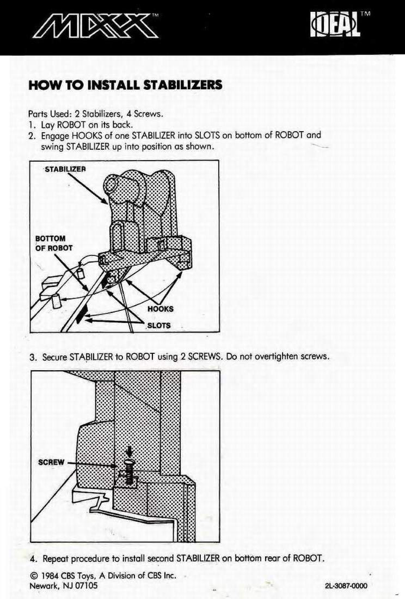

# Chapter 9 — Cautions, FCC, and stabilizers

Archival scan of the factory booklet: [`Chassis/Manual/MaxxSteeleManual.pdf`](../Chassis/Manual/MaxxSteeleManual.pdf). Programmer quick reference: [`Chassis/Manual/MaxxSteeleReferenceGuide.pdf`](../Chassis/Manual/MaxxSteeleReferenceGuide.pdf).

However, there is no guarantee that interference will not occur ina
particular installation. If this equipment does cause interference to
radio or television reception, which can be determined by turning the
robot off and on, the user is encouraged to try to correct the
interference by one or more of the following measures:

® Reorient the receiving antenna on the radio or TV receiving
interference.

® Move the robot away from the receiver.

¢ Plug the charger into a different outlet so that the robot and receiver
are on different branch circuits.

If necessary, the user should consult the dealer or an experienced
radio/television technician for additional suggestions. The user may
find the following booklet prepared by the Federal Communications
Commission helpful:

‘How to Identify and Resolve Radio/TV Interference Problems”

This booklet is available from the U.S. Government Printing Office,
Washington, DC 20402. Stock No. 004-000-00345-4.

€1984 CBS Toys, A Division of CBS Inc., Newark, NJ 07105
2L-3076-0000
